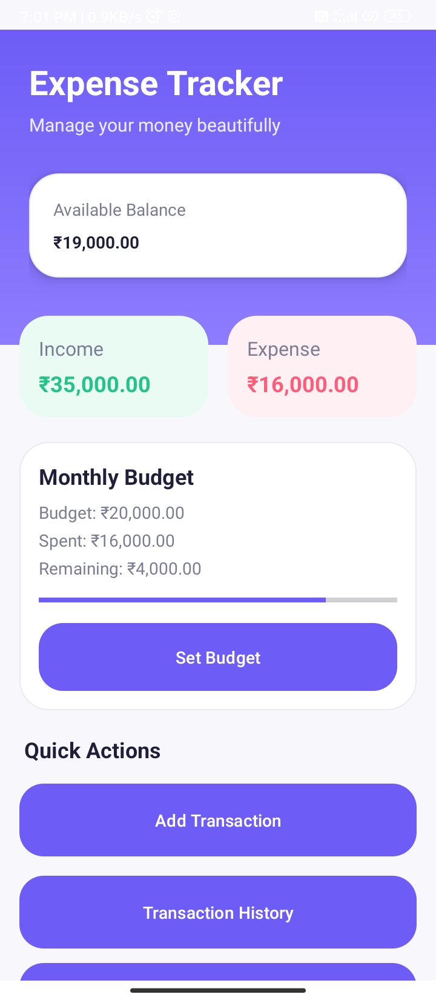
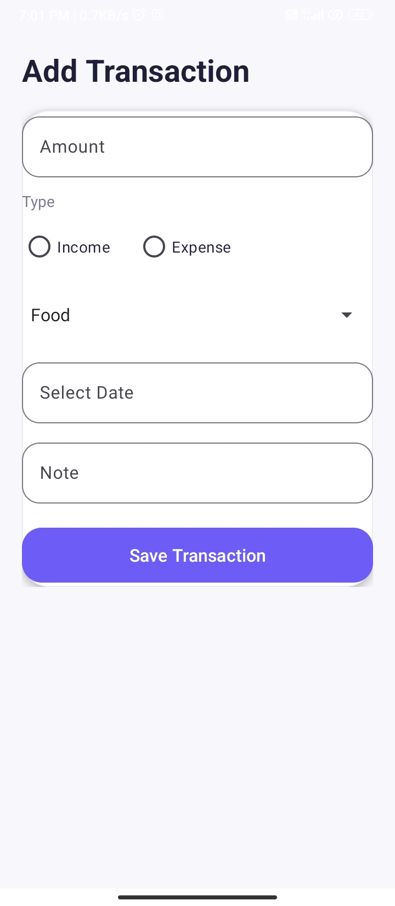
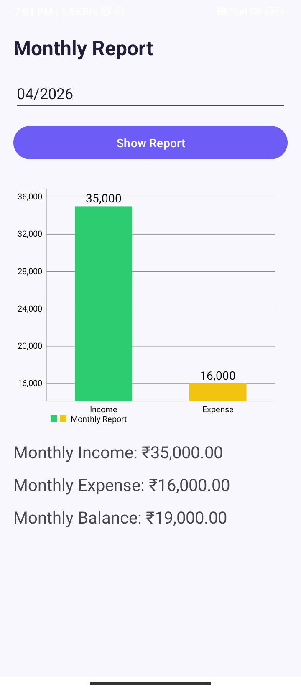
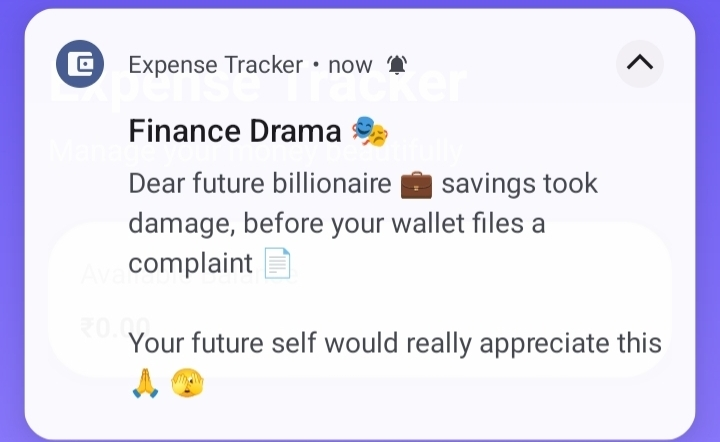
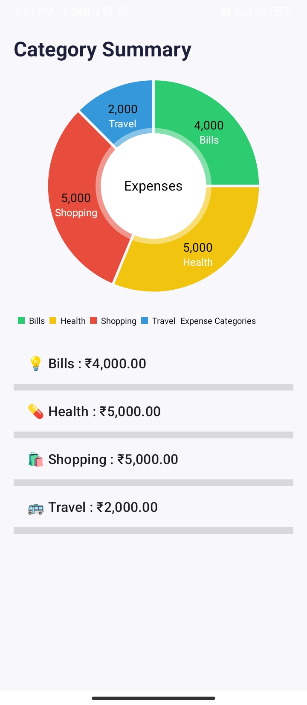

# 💸 Expense Tracker Android App

[](https://developer.android.com)
[](https://www.java.com/)
[](https://www.sqlite.org/)

**Expense Tracker** is a modern Android application built with Java and Android Studio. It helps you manage daily expenses, track income, monitor monthly budgets, and receive smart notifications — all with a clean, gradient‑styled UI.

---

## 📱 Features

- ➕ **Add Income & Expenses** – Quick entry with amount, category, and notes  
- 📜 **Transaction History** – View all past transactions in a scrollable list  
- 📂 **Category‑wise Summary** – See how much you spend on food, travel, bills, etc.  
- 📅 **Monthly Reports** – Analyse income vs expenses for any month  
- 💰 **Budget Tracking** – Set monthly budgets and visualise progress with a progress bar  
- 🔔 **Smart & Funny Notifications** – Get engaging alerts (like Swiggy/Zomato style 😄)  
- 🎨 **Modern UI** – Smooth gradients, material design, and intuitive layout  

---

## 🛠️ Tech Stack

| Layer       | Technology                    |
|-------------|-------------------------------|
| Language    | Java                          |
| IDE         | Android Studio                |
| Database    | SQLite (local)                |
| UI          | XML (Material Design + Gradients) |
| Version Control | Git & GitHub              |

---

## 📸 Screenshots


| Home Screen | Add Transaction | Monthly Report |
|-------------|----------------|----------------|
|  |  |  |

| Notifications | Category Summary |
|---------------|------------------|
|  |  |


---

## 🚀 How to Run

1.  **Clone the Repository**
    ```bash
    git clone https://github.com/nandeesh2799/expense-tracker.git
    ```
2.  **Open in Android Studio**
    Launch Android Studio and select `Open an Existing Project`, then navigate to the cloned directory.
3.  **Sync Gradle**
    Wait for Android Studio to sync dependencies.
4.  **Run**
    Connect your physical device via USB or start an emulator and click the **Run (▶️)** button.

---

## 📈 Future Improvements

- [ ] **Firebase Integration:** For cloud synchronization and user authentication.
- [ ] **Data Visualization:** Integration of Pie and Bar charts for expense analytics.
- [ ] **Dark Mode Support:** System-wide dark theme compatibility 🌙.
- [ ] **Data Export:** Generate and export financial reports in PDF or Excel formats.

---

## 👨‍💻 Author

**Nandeesh N K**   **GitHub:** [@nandeesh2799](https://github.com/nandeesh2799)

---

## ⭐ Support

If you find this project useful, please consider giving it a **Star** on GitHub!
